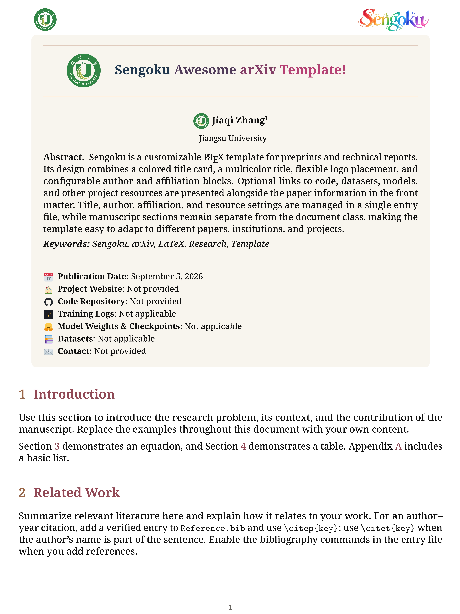

<h1 align="center">Sengoku Awesome arXiv Template!</h1>

**Sengoku** is a customizable LaTeX template for preprints and technical reports. It combines a colorful title card, flexible logos and author affiliations, and convenient links to code, datasets, and other project resources. With manuscript content separated from layout settings, you can focus on writing and adapt the same design to your own research.


## Preview

<div align="center">
  <b>Sengoku</b><br>
  
  
  <br><br>
  
  <b>First-Page Preview</b><br>
  
</div>

## Quick Start

1. Download
```bash
git clone https://github.com/Arxiv-Template/Arxiv-Template.git
```
2. Upload the project to **Overleaf** and select **pdfLaTeX** as the compiler.
3. Edit `main.tex` to set your title, authors, affiliations, logos, and resource links.
4. Write your manuscript in `Sections/` and put your figures in `Figures/`. Add references to `Reference.bib` and cite them when needed.
5. Click **Recompile** and download your PDF.


## Acknowledgments

Many thanks to [WangRongsheng/Arxiv-Template](https://github.com/WangRongsheng/Arxiv-Template), the reference template on which Sengoku is based.

---

<p align="center">If Sengoku helps with your writing, please give this project a ⭐ <strong>Star</strong>!<br>Thank you for your support.</p>
